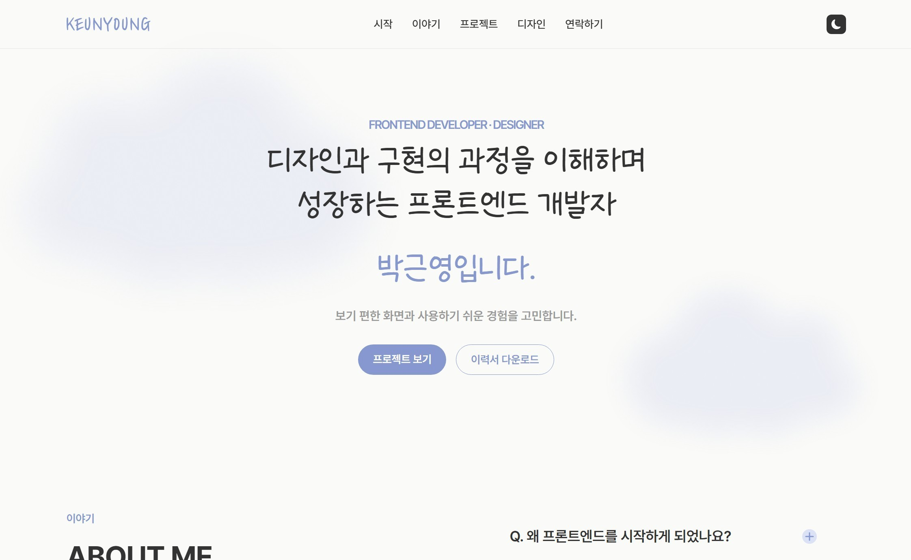

# 2026 Keunyoung Portfolio
디자인과 구현의 과정을 이해하며 성장하는 프론트엔드 개발자 박근영의 원페이지형 포트폴리오 웹사이트입니다.

## 미리보기

## 배포 링크
[2026 Keunyoung Portfolio 배포 링크](https://kyoung-codes.github.io/resume2026/)

## 주요 기능
### 반응형 웹
- Destop, Tablet, Mobile 환경에 대응
### 다크모드
- Light/Dark theme 지원
- 컨셉에 맞게 Light theme에서는 구름과 Dark theme에서는 별로 분위기 연출
### 인터렉션
- Hover 효과
- Fade-up 애니메이션

## 프로젝트 구조
portfolio/
├── index.html
├── css/
│   ├── reset.css
│   └── style.css
├── images/
├── font/
└── README.md

## 향후 개선 계획
- 프로젝트 링크 연결
- 디자인 아카이브 추가
- 접근성 개선
- 성능 최적화

## 제작 정보
- 제작자 : 박근영
- 기간 : 2026.05 ~ 2026.06
- 참여도 : 100%
